  

  

## whoami

- artix linux + wayland, daily driver
- python, shell, rust. small tools, mostly for my own setup
- FOSS. if I use it every day, I publish it
- give back to the commons: code, fixes, docs
- effective accelerationism. progress compounds, so I ship
- currently: waybar-pomodoro, claudestateanchor, contextslice

## projects

| Project | What it does | Stack |
|---|---|---|
| [**waybar-pomodoro**](https://github.com/qwerpik/waybar-pomodoro)  | Focus timer inside Waybar. Zero background CPU, atomic locks, DND while you focus, mouse-wheel to adjust. | Python, Waybar, Wayland |
| [**claudestateanchor**](https://github.com/qwerpik/claudestateanchor)  | Keeps Claude Code session memory across compactions. Zero-dependency plugin, 4 small hooks, fully offline. | Node, shell, hooks |
| [**contextslice**](https://github.com/qwerpik/contextslice)  | Picks what files an agent should read under a token budget. Pre-alpha: engine not built yet, workspace and CI are. | Rust, tree-sitter, SQLite |

## stack

## stats

<table>
  <tr>
    <td colspan="2" align="center">
      
    </td>
  </tr>
  <tr>
    <td align="center">
      
    </td>
    <td align="center">
      
    </td>
  </tr>
</table>

## contribution graph

<picture>
  <source media="(prefers-color-scheme: dark)" srcset="https://raw.githubusercontent.com/qwerpik/qwerpik/output/snake-dark.svg" />
  <source media="(prefers-color-scheme: light)" srcset="https://raw.githubusercontent.com/qwerpik/qwerpik/output/snake.svg" />
  
</picture>

---

Built by [qwerpik](https://github.com/qwerpik)

 

If one of the projects above saved you time, star it. That is the whole CTA.

&nbsp;

<!-- previous version kept in README.backup.md -->
<!-- qwerpik@github:~$ exit -->

